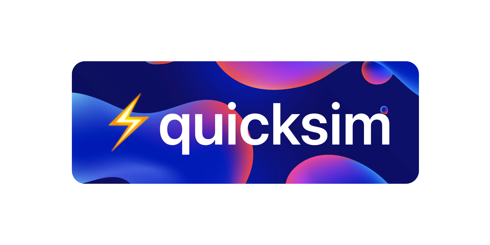

Lightning fast (embedding) vector similarity search for recommendation.

[//]: <> (quicksim / hypervec / fastrec / hypervector / turboquery / speedsearch / hypersift / blaze / topsearch)


/

Lightning fast top item search for recommendations

---

* Sparse matrix cosine/jaccard vector similarity
* Augment embedding vectors (Euclidean trick)
* Inner (dot) product search (recommendation purposes)
* Approximate Nearest Neighbor search (ANN)

---

Quicksim implements algorithms for Approximate Nearest Neighbor (ANN) search in high-dimensional space.

Searching through data for similar items is a common operation in databases, search engines, and many other applications.

---

A common data representation in Machine Learning is a vector in high-dimensional space. For example, matrix factorization algorithms represent users and items as latent embedding vectors. Similarly, NLP is powered by latent word embedding vectors.

Annoy increases the speed of recommendation and similar user/item search for large data-sets at low memory cost. Based on an implementation of Approximate Nearest Neighbours search. The same algorithm is used for personalized music recommendations at Spotify.

The massive speed-up comes at the cost of slighly reduced accuracy. In practice this accruacy is often unneccesary.
The method does not guarantee to find the exact nearest neighors. In a large-scale recommendation setting this is not a problem
because a large amount of items are relevant, regardless of negligible differences
in estimated scores.

---

### Install

```bash
pip install hypervector
```

### Quick Start
https://www.pinecone.io/docs/quickstart-python/

```python
import quicksim
import numpy as np

vectors = np.array([[1, 2, 3], [1, 2, 4]])
```

### Resources
* https://jalammar.github.io/illustrated-word2vec/
* https://notebook.community/SheffieldML/notebook/lab_classes/ambassadors/movie_recommender
* https://www.pinecone.io/learn/what-is-similarity-search/
* https://www.pinecone.io/learn/vector-database/
* https://github.com/facebookresearch/faiss
* https://radimrehurek.com/gensim/auto_examples/tutorials/run_annoy.html
* https://markroxor.github.io/gensim/static/notebooks/annoytutorial.html
* https://www.pinecone.io/docs/examples
* https://www.pinecone.io/docs/quickstart-python/
* https://towardsdatascience.com/neural-network-embeddings-explained-4d028e6f0526
* https://www.benfrederickson.com/approximate-nearest-neighbours-for-recommender-systems/


The importance of (embedding) vectors for ML purposes is exploding. They are fundamental in NLP, (image) similarity search and recommender systems.

Product, news or other item personalization requires fast similarity search of vectors. Such algorithms exist but are largely unknown, complicated and unused in the real-world. I would like to build an easy production-grade library for this.

Most promising use-case at this point is to drive scalable online customer personalization.

Vector models are being used in a lot of different fields: natural language processing, recommender systems, computer vision, and other things. They are fast and convenient and are often state of the art in terms of accuracy. One of the challenges with vector models is that as the number of dimensions increase, finding similar items gets challenging. Erik developed a library called "Annoy" that uses a forest of random tree to do fast approximate nearest neighbor queries in high dimensional spaces. We will cover some specific applications of vector models with and how Annoy works.

-----

Use-cases:

Item vectors -> find most similar items
User and item vectors -> recommend top items to a user
